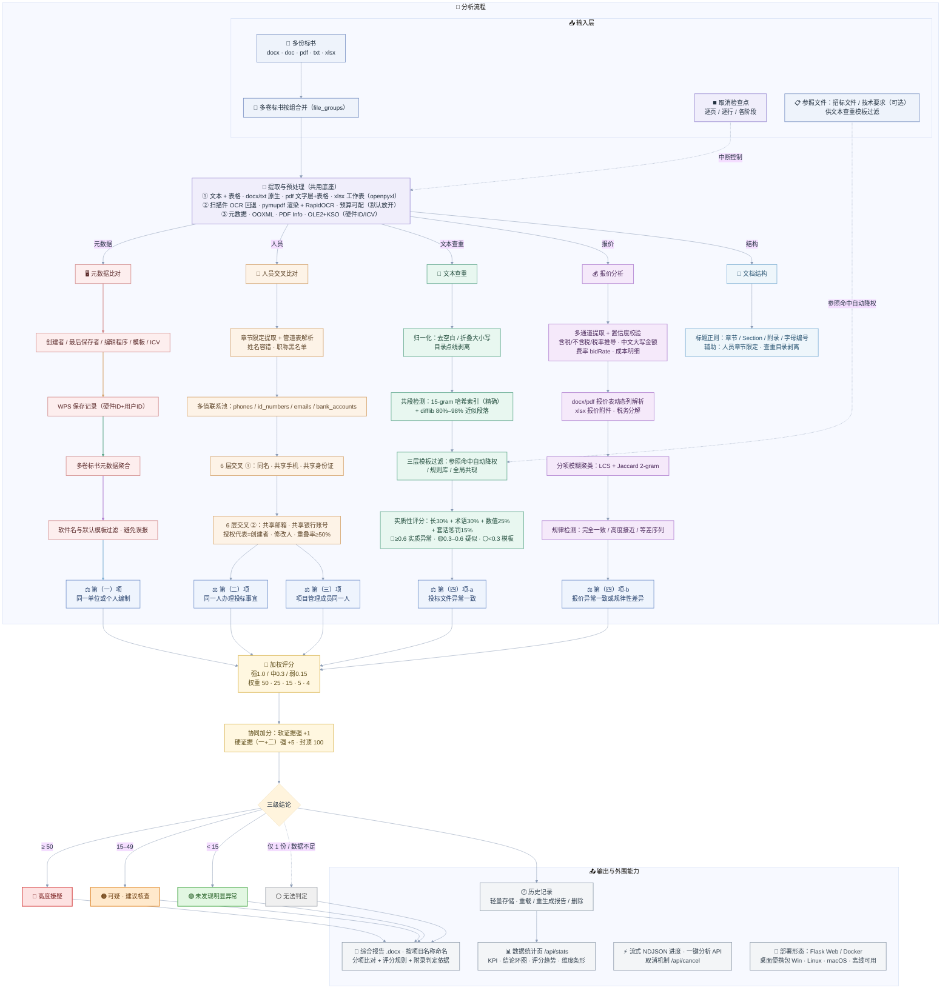

```mermaid
%%{init: {"theme":"base","themeVariables":{"fontFamily":"PingFang SC, Microsoft YaHei, sans-serif","fontSize":"18px","lineColor":"#8a9bb5","primaryTextColor":"#22303f"},"flowchart":{"nodeSpacing":55,"rankSpacing":95,"curve":"basis","htmlLabels":true,"markdownAutoWrap":false,"wrappingWidth":600}}}%%
flowchart TD
    subgraph ANALYSIS["🧩 分析流程"]
        subgraph IN["📥 输入层"]
            A["📄 多份标书<br/>docx · doc · pdf · txt · xlsx"]
            A1["🔗 多卷标书按组合并（file_groups）"]
            C3["⏹️ 取消检查点<br/>逐页 / 逐行 / 各阶段"]
            B["📋 参照文件：招标文件 / 技术要求（可选）<br/>供文本查重模板过滤"]
        end
        A --> A1
        A1 --> C
        C3 -. "中断控制" .-> C
        B -. "参照命中自动降权" .-> T3
        C["📝 提取与预处理（共用底座）<br/>① 文本 + 表格 · docx/txt 原生 · pdf 文字层+表格 · xlsx 工作表（openpyxl）<br/>② 扫描件 OCR 回退 · pymupdf 渲染 + RapidOCR · 预算可配（默认放开）<br/>③ 元数据 · OOXML · PDF Info · OLE2+KSO（硬件ID/ICV）"]

        M0["🖥️ 元数据比对"]
        M1["创建者 / 最后保存者 / 编辑程序 / 模板 / ICV"]
        M2["WPS 保存记录（硬件ID+用户ID）"]
        M2b["多卷标书元数据聚合"]
        M3["软件名与默认模板过滤 · 避免误报"]
        CL1["⚖️ 第（一）项<br/>同一单位或个人编制"]
        M0 --> M1
        M1 --> M2
        M2 --> M2b
        M2b --> M3
        M3 --> CL1

        P0["👥 人员交叉比对"]
        P1["章节限定提取 + 管道表解析<br/>姓名容错 · 职称黑名单"]
        P2["多值联系池：phones / id_numbers / emails / bank_accounts"]
        P3["6 层交叉 ①：同名 · 共享手机 · 共享身份证"]
        P4["6 层交叉 ②：共享邮箱 · 共享银行账号<br/>授权代表=创建者 · 修改人 · 重叠率≥50%"]
        CL2["⚖️ 第（二）项<br/>同一人办理投标事宜"]
        CL3["⚖️ 第（三）项<br/>项目管理成员同一人"]
        P0 --> P1
        P1 --> P2
        P2 --> P3
        P3 --> P4
        P4 --> CL2
        P4 --> CL3

        T0["📖 文本查重"]
        T1["归一化：去空白 / 折叠大小写<br/>目录点线剥离"]
        T2["共段检测：15-gram 哈希索引（精确）<br/>+ difflib 80%–98% 近似段落"]
        T3["三层模板过滤：参照命中自动降权<br/>/ 规则库 / 全局共现"]
        T4["实质性评分：长30% + 术语30% + 数值25%<br/>+ 套话惩罚15%<br/>🔴≥0.6 实质异常 · 🟡0.3–0.6 疑似 · ⚪&lt;0.3 模板"]
        CL4["⚖️ 第（四）项-a<br/>投标文件异常一致"]
        T0 --> T1
        T1 --> T2
        T2 --> T3
        T3 --> T4
        T4 --> CL4

        R0["💰 报价分析"]
        R1["多通道提取 + 置信度校验<br/>含税/不含税/税率推导 · 中文大写金额<br/>费率 bidRate · 成本明细"]
        R2["docx/pdf 报价表动态列解析<br/>xlsx 报价附件 · 税务分解"]
        R3["分项模糊聚类：LCS + Jaccard 2-gram"]
        R4["规律检测：完全一致 / 高度接近 / 等差序列"]
        CL5["⚖️ 第（四）项-b<br/>报价异常一致或规律性差异"]
        R0 --> R1
        R1 --> R2
        R2 --> R3
        R3 --> R4
        R4 --> CL5

        S0["📑 文档结构"]
        S1["标题正则：章节 / Section / 附录 / 字母编号<br/>辅助：人员章节限定 · 查重目录剥离"]
        S0 --> S1

        C -- "元数据" --> M0
        C -- "人员" --> P0
        C -- "文本查重" --> T0
        C -- "报价" --> R0
        C -- "结构" --> S0
    end

    CL1 & CL2 & CL3 & CL4 & CL5 --> SC["🎯 加权评分<br/>强1.0 / 中0.3 / 弱0.15<br/>权重 50 · 25 · 15 · 5 · 4"]
    SC --> SY["协同加分：软证据强 +1<br/>硬证据（一+二）强 +5 · 封顶 100"]
    SY --> V{"三级结论"}
    V -->|"≥ 50"| H["🔴 高度嫌疑"]
    V -->|"15–49"| ME["🟠 可疑 · 建议核查"]
    V -->|"&lt; 15"| L["🟢 未发现明显异常"]
    V -.->|"仅 1 份 / 数据不足"| U["⚪ 无法判定"]

    subgraph OUT["📤 输出与外围能力"]
        O1["📄 综合报告 .docx · 按项目名称命名<br/>分项比对 + 评分规则 + 附录判定依据"]
        O2["🕘 历史记录<br/>轻量存储 · 重载 / 重生成报告 / 删除"]
        O3["📊 数据统计页 /api/stats<br/>KPI · 结论环图 · 评分趋势 · 维度条形"]
        O4["⚡ 流式 NDJSON 进度 · 一键分析 API<br/>取消机制 /api/cancel"]
        O5["🚀 部署形态：Flask Web / Docker<br/>桌面便携包 Win · Linux · macOS · 离线可用"]
    end
    H & ME & L & U --> O1
    V --> O2
    O2 --> O3

    linkStyle 4 stroke:#d28a8a,stroke-width:2px
    linkStyle 5 stroke:#d4a26a,stroke-width:2px
    linkStyle 6 stroke:#5fa88c,stroke-width:2px
    linkStyle 7 stroke:#b07fd0,stroke-width:2px
    linkStyle 8 stroke:#7fb0d4,stroke-width:2px

    classDef inp fill:#eef3fb,stroke:#7b93c4,stroke-width:1.5px,color:#22303f
    classDef ext fill:#f0eefb,stroke:#9688d0,stroke-width:1.5px,color:#22303f
    classDef md fill:#fdeeee,stroke:#d28a8a,stroke-width:1.5px,color:#5b2b2b
    classDef ps fill:#fdf3e7,stroke:#d4a26a,stroke-width:1.5px,color:#5b4226
    classDef tx fill:#e8f7f0,stroke:#5fa88c,stroke-width:1.5px,color:#1f4a3a
    classDef pr fill:#f5e9fa,stroke:#b07fd0,stroke-width:1.5px,color:#4b2a5b
    classDef st fill:#eef6fb,stroke:#7fb0d4,stroke-width:1.5px,color:#24506e
    classDef cl fill:#eef4fd,stroke:#6d8fc9,stroke-width:1.5px,color:#1f3a66
    classDef sc fill:#fff7e0,stroke:#d9b24a,stroke-width:1.5px,color:#5b4a16
    classDef hi fill:#fde2e2,stroke:#d64545,stroke-width:2px,color:#7a1f1f
    classDef me fill:#ffe9cc,stroke:#e08a2e,stroke-width:2px,color:#6b3d0f
    classDef lo fill:#e2f7e2,stroke:#4aa84a,stroke-width:2px,color:#1f5b1f
    classDef un fill:#f0f0f0,stroke:#9aa0a8,stroke-width:1.5px,color:#444
    classDef out fill:#f3f5f7,stroke:#8b98a8,stroke-width:1.5px,color:#33404d
    class A,A1,B inp
    class C,C3 ext
    class M0,M1,M2,M2b,M3 md
    class P0,P1,P2,P3,P4 ps
    class T0,T1,T2,T3,T4 tx
    class R0,R1,R2,R3,R4 pr
    class S0,S1 st
    class CL1,CL2,CL3,CL4,CL5 cl
    class SC,SY sc
    class H hi
    class ME me
    class L lo
    class U un
    class O1,O2,O3,O4,O5 out
```
